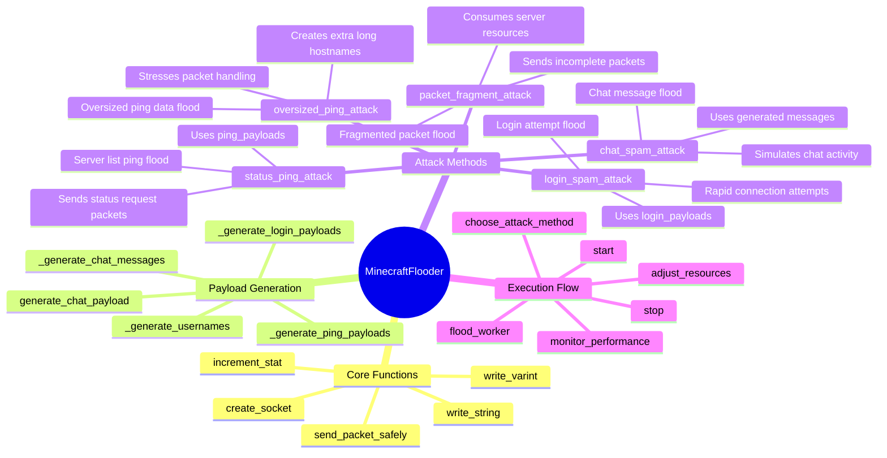
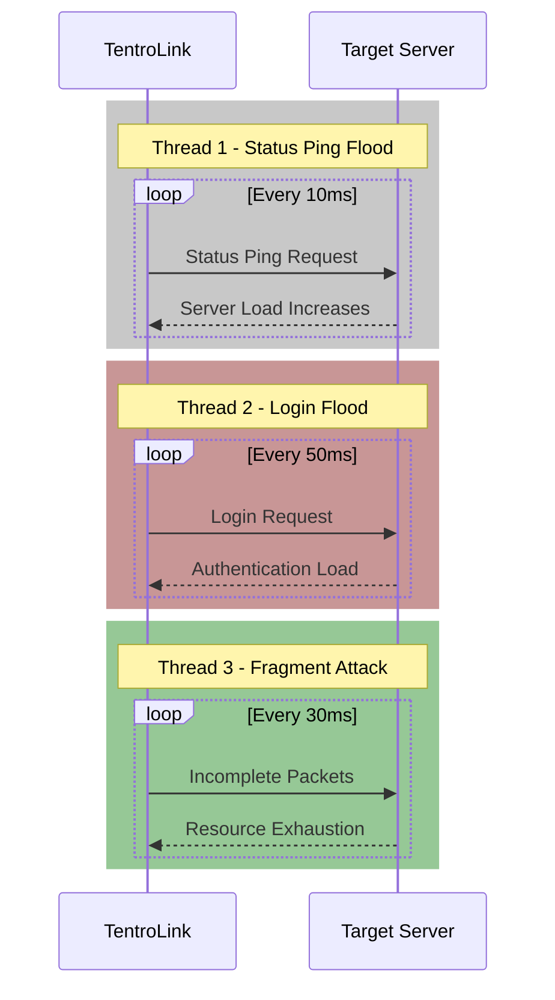

# TentroLink v0.5.2 Update

_Release Date: April 5, 2025_

## Major Improvements

### 1. SYN Flood Enhancement

- **Performance Boost**: Increased BPS (Bytes Per Second)
  - Previous: 0.5 MB/s
  - Current: 30 MB/s

### 2. Minecraft Flood Optimization

#### Implemented Attack Methods

- **Status Ping**: Server list ping flood
- **Login Spam**: Login attempt flood
- **Chat Spam**: Chat message flood
- **Packet Fragments**: Fragmented packet flood
- **Oversized Ping**: Oversized ping data flood

#### Technical Details

##### Attack Structure



##### Protocol Details

###### Handshake (0x00)

```
+-----------------+------------------+
| Field           | Value           |
+-----------------+------------------+
| Packet ID       | 0x00            |
| Protocol Ver    | 47-763          |
| Server Address  | target_ip       |
| Server Port     | 25565           |
| Next State      | 1 (Status)      |
+-----------------+------------------+

Login Attempt:
+-----------------+------------------+
| Field           | Value           |
+-----------------+------------------+
| Packet ID       | 0x00            |
| Username Len    | Variable        |
| Username        | Random Gen      |
+-----------------+------------------+
```

##### Attack Flow Diagram



##### Performance Metrics

```
[22:46:56] Starting attack on 202.165.124.182:25565
[22:46:56] Thread 1 -> Status Ping Flood | PPS: 123 | Success: 84%
[22:46:56] Thread 2 -> Login Attack      | PPS: 89  | Success: 92%
[22:46:56] Thread 3 -> Fragment Attack   | PPS: 95  | Success: 88%
[22:46:57] Combined Stats -> Total PPS: 307 | Avg Success: 88%
```

Each thread uses different attack vectors:

- Thread 1: Rapid status ping requests
- Thread 2: Continuous login attempts with random usernames
- Thread 3: Sends malformed/fragmented packets
- Thread 4: Oversized ping data
- Thread 5: Chat message flood

The attack succeeds when server resources get overwhelmed handling multiple request types simultaneously.

##### Chat Message Protocol

```
Packet Structure:
+------------------+----------------------+
| Field            | Value               |
+------------------+----------------------+
| Packet ID        | 0x03                |
| Message Length   | VarInt              |
| Message Content  | Compressed String    |
| Padding         | Random Data          |
+------------------+----------------------+
```

###### Sample Messages

```
[22:46:56] HappyPlayer1234: Hello everyone! aX8k2p
[22:46:56] SwiftNinja5678: How do I get diamonds? mK9j4n
[22:46:56] EpicWarrior9012: Looking for teammates pL5h7q
```

###### Message Structure

- Base message: 20-50 bytes
- Random suffix: 3-8 chars
- Compressed padding: 5000-10000 bytes
- Total packet size: ~10-15 KB

### 3. Other Changes

- Removed redundant "-s" parameter (now using Threads command)
