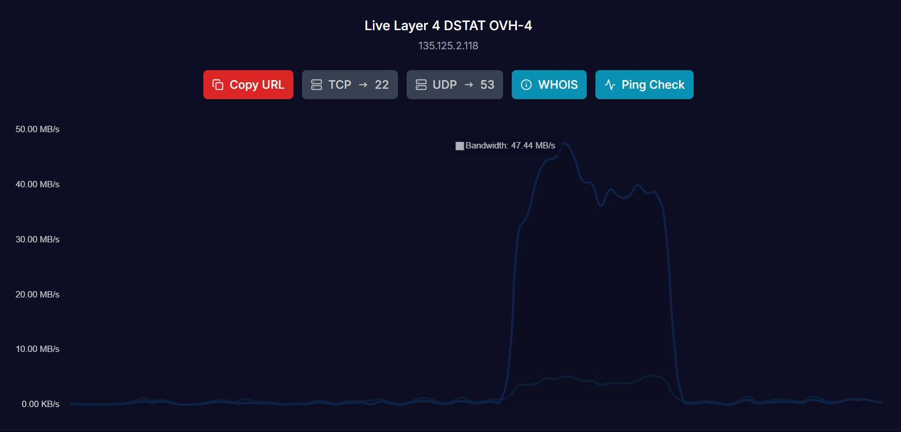

# v0.6.5 Update (2025-05-28)

## Changes

- Added advanced connection management utilities for Layer 7 attack modules:
  - Implemented a `ConnectionPool` class for efficient connection reuse, automatic cleanup, and resource management.
  - Introduced `_enable_keepalive` for platform-optimized TCP keep-alive settings.
  - Added `KeepAliveManager` for HTTP keep-alive connection tracking and renewal.
  - Provided `_optimize_socket_buffers` for per-target socket buffer tuning.
  - Added `AdaptiveBufferManager` to dynamically adjust socket buffer sizes based on real-time performance.
  - **Introduced `HTTP2ConnectionManager` for HTTP/2 connection multiplexing:**
    - Allows multiple HTTP/2 streams to share a single connection, efficiently reusing connections and reducing the overhead of establishing new ones.
    - Manages stream lifecycle, prioritization, flow control, and automatic cleanup of idle connections.
    - Tracks metrics for connection reuse, stream creation/closure, and flow control updates, making it easier to monitor and tune performance.
- These improvements are designed to maximize throughput, reduce connection overhead, and adapt to network conditions during high-volume Layer 7 operations.

## Impact

- More efficient and stable connection handling for HTTP/HTTPS/QUIC/other Layer 7 methods.
- Improved performance and reliability under heavy load or with many concurrent threads.
- **HTTP/2 multiplexing enables sending many requests in parallel over a single connection, increasing throughput and reducing latency.**
- Makes the attack logic more robust and scalable, as connections are reused and managed automatically, and streams are prioritized for optimal delivery.
- Easier extension and tuning of connection logic for future protocol support.
- No breaking changes to configuration or usage; these are internal enhancements for better resource management and attack effectiveness.

## Proof of Performance

- 
- The screenshot above shows the OVH-4 method running on dstast su, demonstrating improved performance and stability with the new connection management features.
